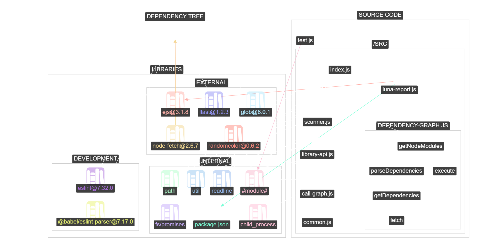

[](https://www.npmjs.com/package/luna-scanner)
[](https://www.npmjs.com/package/luna-scanner)
[](https://github.com/royvandijk06/luna/issues)
[](https://github.com/royvandijk06/luna/stargazers)


# ☾ LUNA - Library Usage in Node.js Analyzer

<center></center>

## Description
LUNA is a software development tool for node.js (and other javascript) projects, with a focus on libraries. The goal of LUNA is to aid developers in better understanding how libraries are being utilized in their projects.

## Requirements
 * [Node.js](https://nodejs.org/en/)
 * Your node.js project

## Usage
Inside any node.js project, run:
```bash
npx luna-scanner
```
After analyzing the source code, it will generate a LUNA report, which includes a [visualization](https://raw.githubusercontent.com/royvandijk06/luna/main/luna.png) about the interaction between source code and libraries.

<details>
 <summary>LUNA Report Manual</summary>
 
 * Drag (click and hold) the mouse to pan around or move nodes around
 * Use the mouse wheel to zoom in or out
 * Hovering over a node will display information on the bottom left and highlight connected nodes
 * Using Shift + Click on a node will lock it, so that focus remains on this node (Shift + Click node again to unlock)
 * Double Click nodes or groups in the graph or menu to collapse/expand them
 * Use the menu on the left to manipulate the graph:
    1. Adjust the scale of the graph / space between nodes
    2. Adjust the layout of the graph / position of the nodes
    3. Hide a selection of nodes (representing libraries or files)
    4. Highlight a selection of nodes (representing libraries or files)
 * Hover your mouse above menu items to find more information about their functionality
</details>

## Configuration
Via `package.json` (defaults):
```
{
   ...
   "luna": {
      "debug": false,            // toggle debug mode
      "components": {            // toggle components of LUNA
         "callGraph": true,      // detection of function calls within files
         "dependencyTree": true, // detection of dependency chains
         "libraryAPI": true,     // detection of used API of libraries
      },
      "ignore": [],              // array of glob patterns for LUNA's scanner to ignore
   },
   ...
}
```
Via command line arguments (limited):
```bash
npx luna-scanner [path_to_project] [debug]
```

## Known Issues
 * The [library](https://github.com/iVis-at-Bilkent/cytoscape.js-expand-collapse) used to handle collapsing and expanding of nodes may break in some situations. Best to avoid excessive collapsing/expanding.
 
## Feedback
Much appreciated!
I encourage you to use [my feedback form](https://forms.gle/EcxLY7EsepptZ7Mn8).
